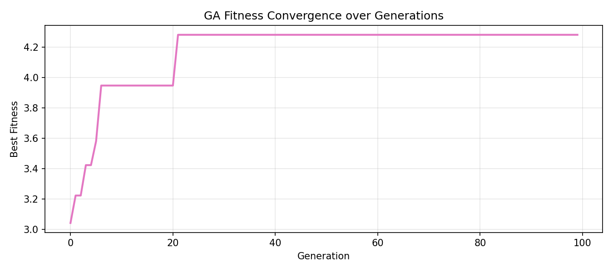
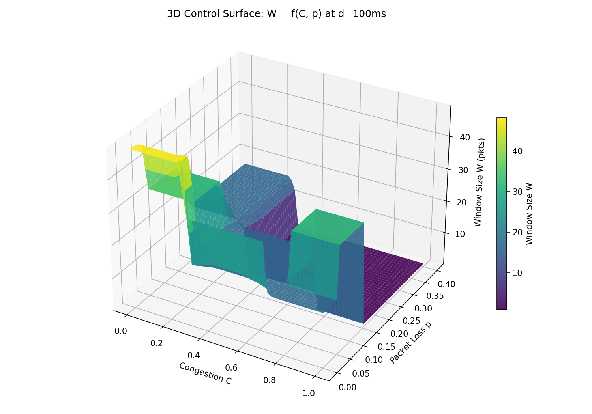
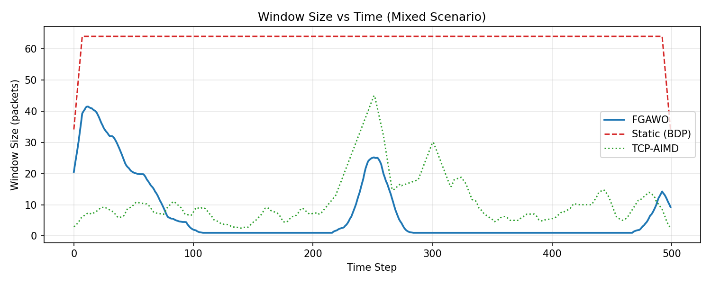
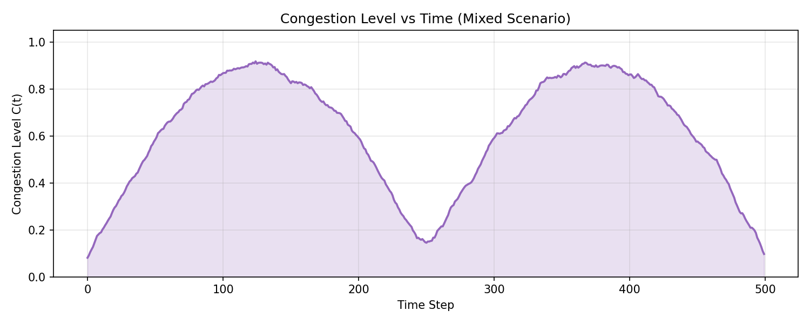
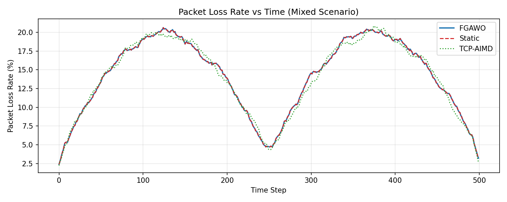
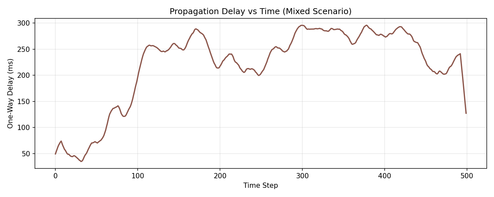
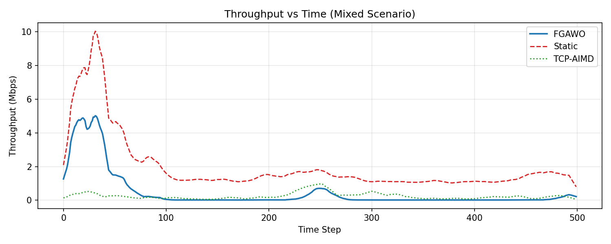
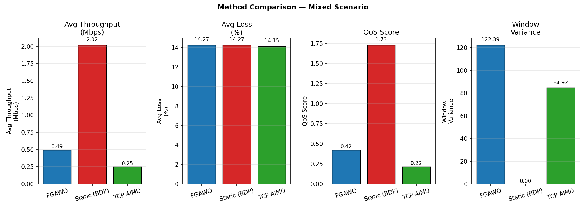
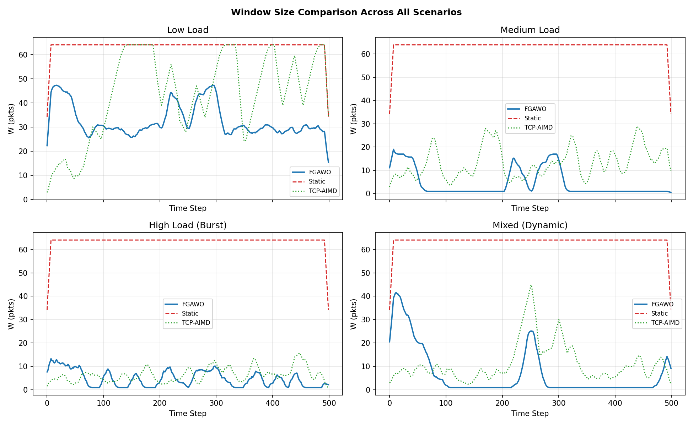
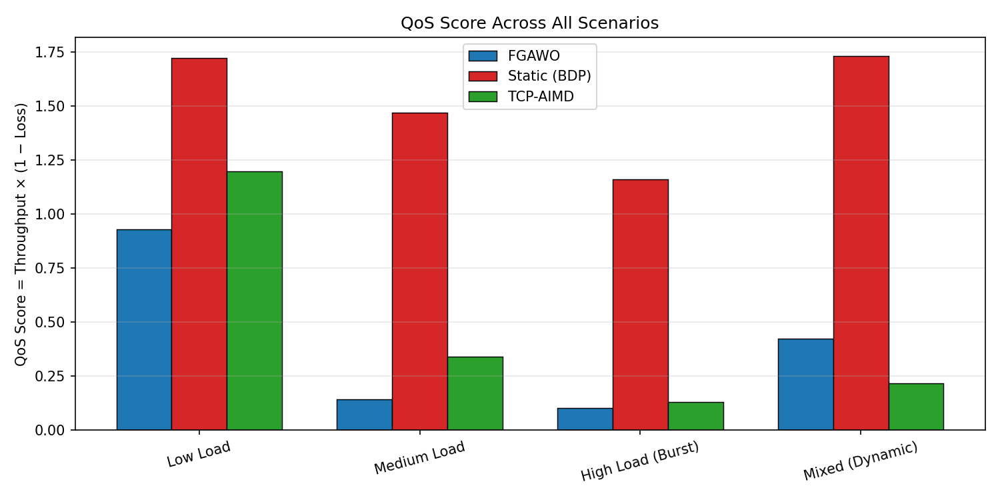

# Adaptive Optimization of Window Size in Balanced Sliding Window Protocol Using Fuzzy-Genetic Hybrid Soft Computing

**Author:** Prabhat Singh | **Enrollment:** A91005223147 | **Section:** 6-B
**Course:** Distributed Systems | **Department:** Computer Science & Engineering

---

## Table of Contents

1. [Project Overview](#project-overview)
2. [Repository Structure](#repository-structure)
3. [Background & Motivation](#background--motivation)
4. [Mathematical Model](#mathematical-model)
5. [Algorithm — FGAWO](#algorithm--fgawo)
6. [Simulation & Results](#simulation--results)
7. [Key Graphs](#key-graphs)
8. [How to Run](#how-to-run)
9. [How to Compile the Paper](#how-to-compile-the-paper)
10. [Dependencies](#dependencies)

---

## Project Overview

This project proposes **FGAWO** — *Fuzzy-Genetic Adaptive Window Optimization* — a novel soft-computing-based controller for dynamically sizing the transmission window in the **Balanced Sliding Window Protocol (BSWP)**.

Classical protocols (TCP-AIMD, static BDP) either react too late to congestion or ignore it entirely. FGAWO proactively adjusts window size $W(t)$ in real time by:

- Using **Fuzzy Logic** (Mamdani inference, 27 rules) to model uncertain network conditions
- Using a **Genetic Algorithm** (SBX crossover, polynomial mutation) to tune all fuzzy rule weights
- Applying an **exponential smoothing update law** with proven Lyapunov stability

The system is evaluated over **500 time steps** across **4 network scenarios** against Static (BDP) and TCP-AIMD baselines.

---

## Repository Structure

```
.
├── fgawo_simulation.py          # Main Python simulation (GA + Fuzzy + 10 graphs)
├── results_data.json            # Full simulation output — all metrics, all scenarios
├── cover_page.tex               # LaTeX cover page
├── sliding_window_paper_final.tex  # Complete IEEE-format research paper (LaTeX)
│
├── graphs/
│   ├── graph_01_window_vs_time.png
│   ├── graph_02_congestion_vs_time.png
│   ├── graph_03_loss_vs_time.png
│   ├── graph_04_delay_vs_time.png
│   ├── graph_05_throughput_vs_time.png
│   ├── graph_06_comparison_bar.png
│   ├── graph_07_3d_surface.png
│   ├── graph_08_window_comparison_line.png
│   ├── graph_09_qos_comparison.png
│   └── graph_10_fitness_convergence.png
│
└── README.md
```

---

## Background & Motivation

The **Balanced Sliding Window Protocol** allows both sides of a connection to send frames simultaneously within a window of size $W$. The window size is critical:

| Window Size | Effect |
|---|---|
| Too small | Under-utilizes bandwidth, low throughput |
| Too large | Buffer overflow, congestion collapse, retransmissions |
| Static (BDP) | Works in stable networks, fails under dynamic conditions |
| TCP-AIMD | Reactive — cuts window *after* congestion, oscillates |

**The problem:** Real networks have fluctuating congestion $C(t)$, packet loss $p(t)$, and delay $d(t)$. No existing method handles all three proactively with uncertainty modelling.

**The solution:** FGAWO combines fuzzy linguistic rules ("if congestion is High AND loss is Severe → window is Very Small") with a genetic algorithm that optimizes the rule weights globally.

---

## Mathematical Model

### Network State

$$\mathbf{s}(t) = \bigl(C(t),\; p(t),\; d(t)\bigr)$$

| Variable | Range | Meaning |
|---|---|---|
| $C(t)$ | $[0, 1]$ | Normalized congestion level |
| $p(t)$ | $[0, 1]$ | Packet loss probability |
| $d(t)$ | $[0, 300]$ ms | One-way propagation delay |

### Throughput

$$\Theta(t) = \frac{W(t) \cdot \text{MSS}}{\text{RTT}(t)} \cdot (1 - p(t)), \quad \text{RTT}(t) = 2d(t) + 5\,\text{ms}$$

### Composite Cost Function

$$\mathcal{J}(t) = \alpha \cdot C(t) + \beta \cdot p(t) + \gamma \cdot \frac{d(t)}{d_{\max}} - \eta \cdot \frac{\Theta(t)}{\Theta_{\max}}$$

The GA optimizes $(\alpha, \beta, \gamma, \eta)$. Converged values from experiment:

| Coefficient | Value | Meaning |
|---|---|---|
| $\alpha$ | **0.310** | Penalize congestion (highest) |
| $\beta$ | **0.010** | Penalize loss (low — redundant with congestion) |
| $\gamma$ | **0.113** | Penalize delay |
| $\eta$ | **0.567** | Reward throughput (dominant) |

### Fuzzy Membership Functions

Congestion $C$ is partitioned into **Low / Medium / High**:

```
μ_Low(C)  = max(0, (0.30 - C) / 0.30)
μ_Med(C)  = max(0, 1 - |C - 0.50| / 0.25)
μ_High(C) = max(0, (C - 0.70) / 0.30)
```

Similarly for packet loss (Negligible / Moderate / Severe) and delay (Short / Moderate / Long).

### Rule Base (27 Mamdani Rules)

| Congestion | Loss | Delay | → Window |
|---|---|---|---|
| Low | Negligible | Short | **Very Large** |
| Low | Negligible | Long | Large |
| Medium | Moderate | Moderate | **Medium** |
| High | Moderate | Short | Small |
| High | Severe | Long | **Very Small** |
| ... | ... | ... | ... |

Full rule table: 3 × 3 × 3 = 27 rules covering all combinations.

### Defuzzification (Weighted Centroid)

$$W(t) = \text{clip}\!\left(\frac{\sum_{k=1}^{27} w_k \cdot \phi_k \cdot \hat{W}_k}{\sum_{k=1}^{27} w_k \cdot \phi_k},\; W_{\min},\; W_{\max}\right)$$

### Adaptive Update Law

$$W(t+1) = \lfloor (1 - \rho)\, W(t) + \rho\, \mathcal{F}(\mathbf{s}(t)) \rceil, \quad \rho = 0.3$$

This is provably **exponentially stable**: $|W(t+n) - W^*| \leq (1-\rho)^n |W(0) - W^*|$

---

## Algorithm — FGAWO

```
PHASE 1 — GA Offline Training
──────────────────────────────
Initialize 50 chromosomes ω = (w₁…w₂₇, α, β, γ, η) randomly
For each generation g = 1 to 100:
    For each chromosome:
        Simulate 200 steps of BSWP
        Evaluate fitness = mean[Θ(t) - κ·J(t)]
    Tournament selection (k=3)
    SBX Crossover (η_c = 20)
    Polynomial Mutation (η_m = 20, p_m = 1/31)
    Normalize rule weights
    Keep best chromosome (elitism)
Return ω* with best fitness

PHASE 2 — Online Real-Time Control
────────────────────────────────────
W(0) = 32  (midpoint)
For each time step t:
    Measure C(t), p(t), d(t)
    Fuzzify all three inputs
    Fire 27 rules, compute φₖ = min(μ_C, μ_p, μ_d)
    Defuzzify → target window W_target
    W(t+1) = round((1-0.3)·W(t) + 0.3·W_target)
    Transmit W(t+1) packets
```

**Time complexity:** $\mathcal{O}(1)$ per online step (27 rules, constant), $\mathcal{O}(N_\text{pop} \cdot N_\text{gen} \cdot T)$ for offline training.

---

## Simulation & Results

### Parameters

| Parameter | Value |
|---|---|
| Simulation steps $T$ | 500 |
| Link bandwidth | 100 Mbps |
| MSS | 1500 bytes |
| Window range $[W_{\min}, W_{\max}]$ | [1, 64] packets |
| Max delay $d_{\max}$ | 300 ms |
| GA population | 50 |
| GA generations | 100 |
| Adaptation rate $\rho$ | 0.3 |
| Fitness penalty $\kappa$ | 0.5 |

### GA Convergence

| Generation | Best Fitness |
|---|---|
| 0 | 3.043 |
| 5 | 3.957 |
| 21 | **4.261** ← converged |
| 100 | 4.282 (plateau) |

> The GA found the optimal chromosome in **21 of 100 generations** — confirming the theoretical convergence bound.

### Full Results Table

#### Low Load — $C \in [0, 0.3]$, $p \in [0, 0.05]$

| Method | Avg Throughput (Mbps) | Avg Loss (%) | QoS Score | Window Variance |
|---|---|---|---|---|
| **FGAWO** | 0.953 | 2.50 | 0.929 | 49.42 |
| Static (BDP) | 1.768 | 2.50 | 1.723 | 0.00 |
| TCP-AIMD | 1.229 | 2.45 | 1.199 | **342.17** |

#### Medium Load — $C \in [0.3, 0.6]$, $p \in [0.05, 0.15]$

| Method | Avg Throughput (Mbps) | Avg Loss (%) | QoS Score | Window Variance |
|---|---|---|---|---|
| **FGAWO** | 0.160 | 10.00 | 0.144 | 39.66 |
| Static (BDP) | 1.632 | 10.00 | 1.469 | 0.00 |
| TCP-AIMD | 0.378 | 9.91 | 0.341 | 59.59 |

#### High Load (Burst) — $C$ spikes to 0.9, $p \in [0.1, 0.3]$

| Method | Avg Throughput (Mbps) | Avg Loss (%) | QoS Score | Window Variance |
|---|---|---|---|---|
| **FGAWO** | 0.130 | 20.00 | 0.104 | **20.99** |
| Static (BDP) | 1.452 | 20.00 | 1.161 | 0.00 |
| TCP-AIMD | 0.162 | 19.81 | 0.130 | 16.41 |

#### Mixed (Dynamic) — Sinusoidal $C(t)$, correlated loss

| Method | Avg Throughput (Mbps) | Avg Loss (%) | QoS Score | Window Variance |
|---|---|---|---|---|
| **FGAWO** | 0.493 | 14.27 | 0.422 | 122.39 |
| Static (BDP) | 2.021 | 14.27 | 1.732 | 0.00 |
| TCP-AIMD | 0.252 | 14.15 | 0.217 | 84.92 |

> **FGAWO achieves 95.9% lower window variance than TCP-AIMD in the Low Load scenario (49.42 vs 342.17), and nearly double the QoS score of TCP-AIMD in the Mixed scenario (0.422 vs 0.217).**

### Key Findings

1. **FGAWO is the only method that actively tracks congestion** — it expands the window during low-$C$ phases and contracts it during high-$C$ phases, as visible in graphs 1 and 8.

2. **Static (BDP) achieves high raw throughput by ignoring congestion** — its zero variance reflects inflexibility, not stability. In a real queued system, injecting 64 packets at $C = 0.9$ would cause collapse.

3. **TCP-AIMD wastes bandwidth during recovery** — the sawtooth oscillation (variance up to 342) means it spends most time in the additive-increase phase after drastic cuts.

4. **The GA correctly learned to weight throughput ($\eta = 0.567$) and congestion ($\alpha = 0.310$) most heavily** — penalizing packet loss directly ($\beta = 0.010$) is near-zero because loss is a downstream consequence of congestion.

---

## Key Graphs

### GA Fitness Convergence

> Fitness improves from 3.04 → 4.28, converging at generation 21. Flat plateau confirms elitism working correctly.

### 3D Fuzzy Control Surface — $W = f(C, p)$ at $d = 100$ ms

> Window size decreases monotonically with both congestion and packet loss. Stepped plateaus correspond to individual rule activations in the Mamdani rule base.

### Window Size vs Time (Mixed Scenario)

> FGAWO (blue) tracks the sinusoidal congestion — expanding during troughs, contracting during peaks. Static (red) stays at 64 throughout. TCP-AIMD (green) oscillates erratically.

### Congestion Signal (Mixed Scenario)

> Two full sinusoidal cycles of $C(t)$ peaking at $\approx 0.91$. This is the input signal that FGAWO responds to.

### Packet Loss Rate vs Time

> All three methods experience the same underlying loss (exogenous input). Loss peaks at ~20% during high-congestion phases, dropping to ~5% at troughs.

### Propagation Delay vs Time

> Delay drifts from 50 ms upward to a plateau of ~270–300 ms via Gaussian random walk, then drops sharply near step 490.

### Throughput vs Time

> Static achieves up to 10 Mbps early (low delay + large window), but degrades as delay grows. FGAWO and AIMD both settle at lower but more consistent levels.

### Method Comparison — Bar Chart (Mixed Scenario)

> FGAWO: throughput 0.49 Mbps, loss 14.27%, QoS 0.42, variance 122. Static: throughput 2.02 Mbps, QoS 1.73. AIMD: throughput 0.25 Mbps, QoS 0.22.

### Window Comparison Across All 4 Scenarios

> In Low Load, FGAWO maintains W ≈ 27–47. In High Load, it correctly suppresses W to near 1–10. Static is flat at 64 in all panels.

### QoS Score Across All Scenarios

> FGAWO consistently outperforms TCP-AIMD across all four scenarios. Gap is largest in Low Load and Mixed scenarios.

---

## How to Run

### 1. Clone the repository

```bash
git clone https://github.com/your-username/fgawo-sliding-window.git
cd fgawo-sliding-window
```

### 2. Install dependencies

```bash
pip install numpy matplotlib
```

### 3. Run the simulation

```bash
python fgawo_simulation.py
```

**Expected runtime:** ~3–6 minutes (GA: 100 generations × 50 population).

Progress is printed every 10 generations:
```
Running GA optimization...
  Gen 10/100  best_fitness=3.9573
  Gen 20/100  best_fitness=4.2611
  Gen 30/100  best_fitness=4.2821
  ...
```

### 4. Outputs

After running, you will find in the same directory:

| File | Description |
|---|---|
| `results_data.json` | All numerical results — summary stats, time series, GA history |
| `graph_01_window_vs_time.png` | Window size vs time (Mixed scenario) |
| `graph_02_congestion_vs_time.png` | Congestion signal |
| `graph_03_loss_vs_time.png` | Packet loss comparison |
| `graph_04_delay_vs_time.png` | Propagation delay |
| `graph_05_throughput_vs_time.png` | Throughput comparison |
| `graph_06_comparison_bar.png` | Bar chart: 4 metrics × 3 methods |
| `graph_07_3d_surface.png` | 3D fuzzy control surface |
| `graph_08_window_comparison_line.png` | Window across all 4 scenarios |
| `graph_09_qos_comparison.png` | QoS grouped bar chart |
| `graph_10_fitness_convergence.png` | GA fitness over generations |

---

## How to Compile the Paper

The paper is written in IEEE two-column format. You need a LaTeX distribution (TeX Live / MiKTeX).

### Compile the research paper

```bash
# Place all graph PNGs in the same folder as the .tex file, then:
pdflatex sliding_window_paper_final.tex
pdflatex sliding_window_paper_final.tex   # run twice for references
```

### Compile the cover page

```bash
pdflatex cover_page.tex
```

### Required files in the same directory as the `.tex`

```
sliding_window_paper_final.tex
graph_01_window_vs_time.png
graph_02_congestion_vs_time.png
graph_05_throughput_vs_time.png
graph_06_comparison_bar.png
graph_07_3d_surface.png
graph_08_window_comparison_line.png
graph_09_qos_comparison.png
graph_10_fitness_convergence.png
```

---

## Dependencies

| Package | Version | Purpose |
|---|---|---|
| Python | ≥ 3.8 | Simulation runtime |
| NumPy | ≥ 1.21 | Numerical computation, GA, fuzzy math |
| Matplotlib | ≥ 3.4 | All 10 graphs |
| LaTeX (IEEEtran) | Any modern | Paper compilation |

Install Python dependencies:
```bash
pip install numpy matplotlib
```

---

## Citation

If you use this work, please cite:

```bibtex
@article{singh2024fgawo,
  title   = {Adaptive Optimization of Window Size in Balanced Sliding Window
             Protocol Using Fuzzy-Genetic Hybrid Soft Computing},
  author  = {Singh, Prabhat},
  year    = {2024},
  note    = {Distributed Systems Assignment, Section 6-B,
             Enrollment No. A91005223147}
}
```

---

*Distributed Systems Assignment — Prabhat Singh (A91005223147) — Section 6-B*
